# What's Cooking?

"Family Recipe" is a recipe sharing website made for my Portfolio Project 4 for code institute, where users can upload and share recipes as well as reading recipes from other users.

I thought about this as I have a family recipe book from South Africa and I think it would be great to have a website where family members could share their family recipes with eachother and the world. I also wanted a rating system based on the ammount of likes and a comment section for recipes. 

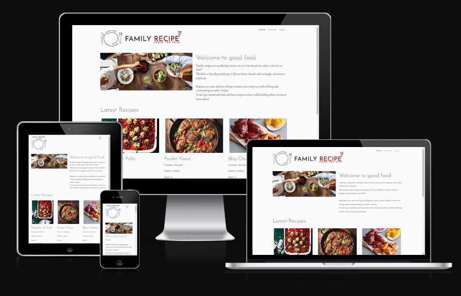

Click [here](https://familyrecipe-66825c6657db.herokuapp.com/) to view the live site.

# Table of Contents
- [Database Diagram](#database-diagram)
  - [Planning](#planning)
  - [Final Result](#final-result)

- [User Experience](#user-experience)
  - [Agile](#agile)
  - [Strategy](#strategy)
  - [Scope](#scope)
  - [Structure](#structure)
  - [Skeleton](#skeleton)
  - [Surface](#surface)

- [Technologies Used](#technologies-used)
  - [Languages](#languages)
  - [Frameworks, Libraries and Programs](#frameworks-libraries-and-programs)

- [Features](#features)
  - [Existing Features](#existing-features)
  - [Future Features](#future-features)

- [Testing and Validation](#testing-and-validation)
  
- [Fixed Bugs](#fixed-bugs)

- [Known Issues](#known-issues)

- [Credits](#credits)
  - [Media](#media)
  - [Content](#content)
  - [Acknowledgements](#acknowledgements)

- [Deployment](#deployment)

- [Development](#development)
  - [Fork](#fork)
  - [Clone](#clone)

  
## Database Diagram

The project uses ElephantSQL as PostgreSQL relational database for storing the data. I used lucidcharts to display the relationships to the different database tables. The main relationships were based on the likes model as these were called both in the recipe model to show the total likes and related back to the unique users, and then also the users liked recipes.

### Planning

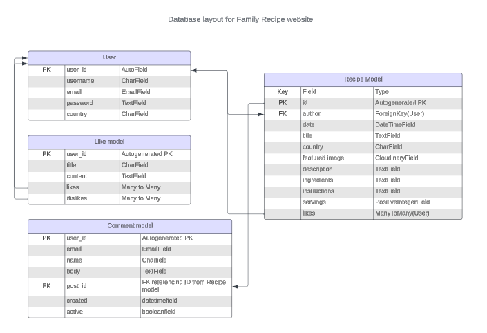


#### Recipe Model
  - This is the main model for the website to function. I based this off the walkthrough I think therefore I blog. Adjusted the layout a bit to fit the website function as a worldwide sharing platform for recipes in mind.

#### Comment Model
 - The comment model allows logged in users to 

#### Category Model
  - The custom model.
  - Enable users to place recipes in different categories.
  - Make it possible to "sort" recipes by categories.

[Back to top ⇧](#table-of-contents)


## User Experience

I used the design thinking approach to create a clutter-free website with only necessary information, making it easy for users to navigate. 

To maximize the user approach, I interviewed my friend Josefine throughout the process. Among other things, she provided valuable tips on displaying categories on each recipe card, which indeed makes the user experience better.

### Agile

I employed the agile methodology, starting from the planning stage and continuing until the final product was built. To ensure that I stayed organized and on track, I utilized a GitHub project and a [Kanban board](https://github.com/users/Kattis91/projects/3/views/1). Information about User Stories can be found in the subsection below⇩ 

**Five planes of User Experience:**

### Strategy

My User Stories can be found [here](https://github.com/Kattis91/what-is-cooking/issues). All User Stories include:
 - Acceptance Criteria
 - Tasks
 - Labels (MoSCoW Priotarization)

Some of the User Stories are part of an EPIC.

Please, go to [TESTING.md](TESTING.md) if you want to come to the section where I test my User Stories.

#### Key Project Goal

Planning what to cook can be a struggle for many. The key project goal of the blog is to establish a visually appealing and user-friendly open-source recipe database. It should not be challenging for users to find what they are looking for. 

Therefore, I have included **categories** on the homepage of the site: 

  - It is a useful feature for users who have a specific food preference and do not want to waste time browsing through all the recipes. By clicking on a category, they can easily find dishes that meet their specific criteria, such as vegetarian dishes. This leads to a more efficient and enjoyable user experience.

  - As for those who don't know what they want, seeing categories can help them narrow down their choices and ultimately get some inspiration and ideas.

With easy-to-follow links, the site is highly navigable.

#### Target Audience

The best part of the blog is that it caters to almost everyone. Of course, you need to be old enough to be in the kitchen.

Whether you are uncertain about meal choices, a food-lover seeking culinary knowledge, or simply a "hungry" person desiring to learn new recipes, tips, and cooking techniques, everybody is welcome!

#### User Requirements and Expectations:

- A brief and simple description of the site’s purpose.

- Easy to navigate the site to find information.

- A quick and thorough overview of the site's features and functionalities.

- Links and functions work as expected.

- Feedback when ineracting with the site.

- Possibility to view the site on a range of device sizes.

### Scope

#### Content | Functionality Requirements:

- Easily accessible navigation bar with the links that have easily understandable names.

- Responsive design.

- A brief and simple description of the site’s purpose.

- A complete collection of recipes.

- A thorough list of ingredients and step-by-step instructions to follow.

- A possibility to sort recipes by categories.

- A possibility to read comments.

#### Authentication:

- Add registration/login features that give the user access to extra functionality.

- Add Logout functionality for safety reasons.

#### Functionality for logged-in users:

  - **CRUD functionality:**

    - Implement feature that allows user to **C**reate recipes.

    - Implement feature that allows user to **R**ead recipes.

    - Implement feature that allows user to **U**pdate recipes.

    - Implement feature that allows user to **D**elete recipes.

  - **Comment and like feature:**

    - Enable logged-in users to post comments on any of the published recipes.

    - Enable logged-in users to like/unlike published recipes.


### Structure

The blog is divided into different pages. Some of the pages are accessible only for logged in users. The blog structure allows users to access recipes via the recipes page or by sorting them through different categories. All users can access detailed information about each recipe by clicking on the recipe card. Users who are logged in can publish, edit, and delete their own recipes, and interact with other recipes by liking and commenting on them.

**For detailed information about all existing features see the section [Existing Features](#existing-features).**


### Skeleton

I created wireframes using [Figma](https://www.figma.com/).

<details>
<summary>Home page</summary>

LEFT: all users | RIGHT: logged-in users.


</details>

<details>
<summary>Recipe page</summary>


</details>

<details>
<summary>Recipe detail page</summary>

LEFT: all users | RIGHT: logged-in users.


</details>

<details>
<summary>Add a Recipe page</summary>


</details>

<details>

<summary>Sign Up</summary>


</details>

<details>
<summary>Login</summary>


</details>

<details>
<summary>Logout</summary>


</details>

### Surface

#### Colour Scheme

The choice of colors depends on the background image chosen for home, sign up, login, and logout pages.


 - **`9AA5AF`** is the primary color used throughout the pages:
   - Welcome message.
   - Category boxes on the home page.
   - Recipe cards.
   - Add | Edit recipe forms.
   - Sign Up | Login | Logout forms.
   - Confirmation message when choosing to delete a recipe.
  
 - **`BAA6B1`** is used to style the navbar, the footer and the "View Recipe" button.

 - **`000000`** is the primary text color used throughout the pages.

 - **`850000`** is used for links and hover styling on navbar and footer. The color was chosen with the help of [Color Contrast Analyzer](https://dequeuniversity.com/rules/axe/4.7/color-contrast) (provided by Lighthouse testing) in order for background and foreground colors to have a sufficient contrast ratio.

 - **`E1DDDD`** is used as the background color for all recipe-related pages including recipes, recipe details, add recipe, edit recipe and categories.

#### Button styling

All buttons throughout the pages have the same styling, ensuring uniformity and providing a seamless user experience. 
 
I went with following colors:
  - `GREEN` that usually is associated with "YES" | "SAVE" | "OK".
  - `#850000` that usually is associated with "NO" | "CANCEL" | "GO BACK".
  - `WHITE` for the text in order to get a sufficient contrast ratio.

    
  
<details>

<summary>Click here to see all the buttons</summary>

- Sign up: 
    
  

- Sign in:
   
  
  
- Logout:

  

- Add a recipe:

  

- Update a recipe:

  

- Delete confirmation:

  

- Edit | Delete:

  

- Submit (when leaving a comment):

  

</details>

#### Recipe images:

Users have the option to upload images in various sizes. To ensure consistency, I made sure that all recipe cards on the same line had the same height. The size of the images doesn't affect the layout of the recipe detail page. All sections are uploaded correctly as they should be.

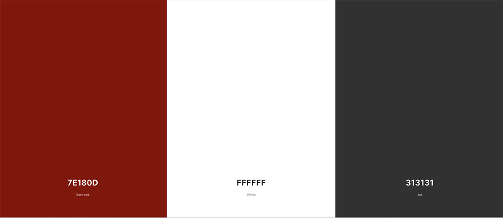

- The colors used were based on the the colors in the logo and the hero image tomato color that stood out to me. I chose the primary color to invoke a feeling of warmth of sharing recipes with community and it matched the heart color as part of the logo. 
  - #7E180D color1
  - #FFFFFF color2 
  - #313131 color3

#### Typography

[Google Fonts](https://fonts.google.com/) was used to import the chosen fonts in use for the site.


- I have used **"Josefin"** for all the headings.

  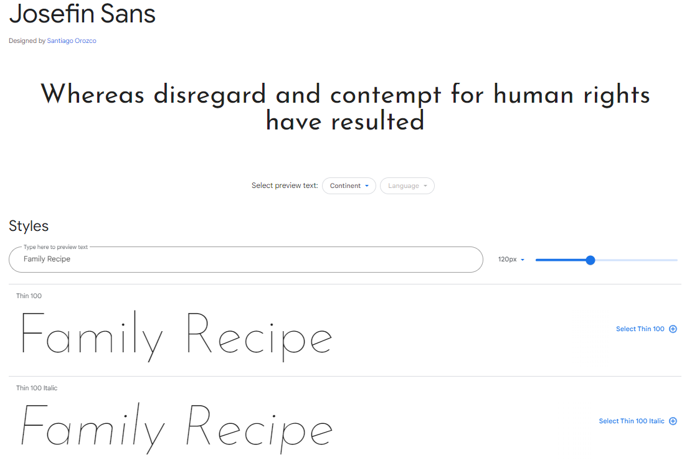

- For the paragraphs I went with **"Crimson"**

  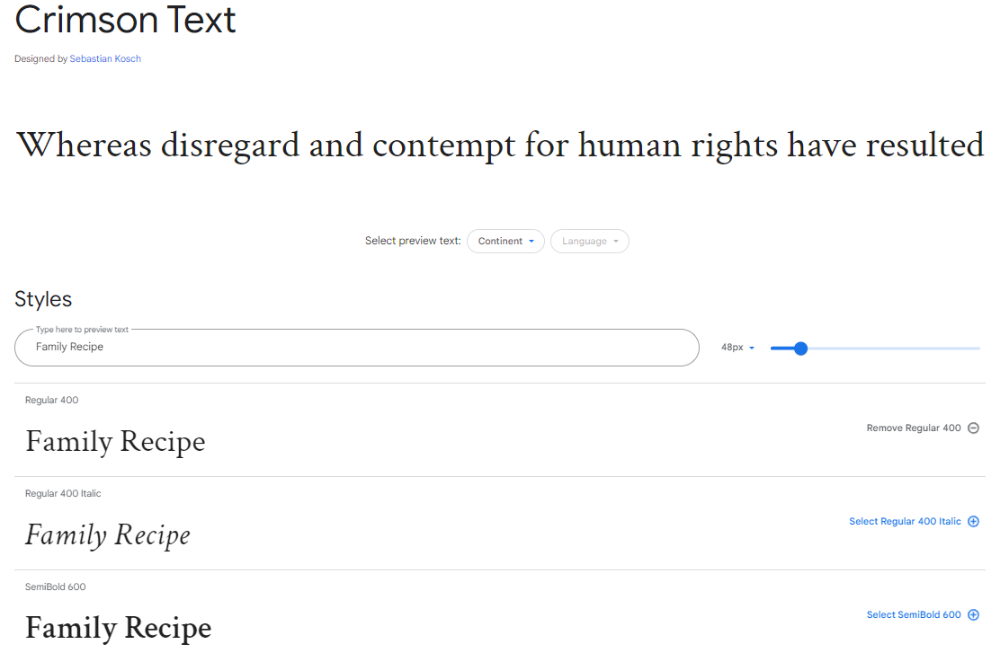

[Back to top ⇧](#table-of-contents)

## Technologies Used

### Languages
 
  - HTML
  - CSS
  - Python
  - JavaScript

### Frameworks, Libraries and Programs

  - [Django](https://www.djangoproject.com/)
   
  - [Django-Allauth](https://docs.allauth.org/en/latest/)
    - used for User authenticaion (sign up, sign in and sign out features).

  - [Django Crispy Forms](https://django-crispy-forms.readthedocs.io/en/latest/)
    - used to control rendering behaviour of Django forms.

  - [Gunicorn](https://docs.djangoproject.com/en/4.2/howto/deployment/wsgi/gunicorn/)
    - Python HTTP server for WSGI applications.
  
  - [ElepantSQL](https://www.elephantsql.com/)
    - Database platform used by the deployed project on Heroku.

  - [Cloudinary](https://cloudinary.com/)
    - The cloud platform used to store static media files.

  - [Git](https://git-scm.com/)
    - used for version controll.

  - [GitPod](https://www.gitpod.io/)
    - The IDE used to create the site.

  - [GitHub](https://github.com/)
    - The code hosting platform used to save and store the files for the website.

  - [Heroku](https://www.heroku.com/)
    - The cloud platform used to deploy the project into live environment.

  - [Bootstrap](https://getbootstrap.com/)
    - The front-end development framework used for styling along with custom CSS.
  
  - [Lucidchart](https://www.lucidchart.com/pages/sv)
    - The diagramming application used to create ERD diagrams.

  - [Am I responsive?](https://ui.dev/amiresponsive)
    - used to see how the site looks on a range of devices.

[Back to top ⇧](#table-of-contents)

## Features

### Existing Features

#### Navigation Bar

- The navbar is at the top right of every page. 
- If the user is logged in or is a guest the menu content changes appropriately. 
- The hamburger menu is applied on media breakpoint of 979px. This was when the text from the navbar started going into the family recipe logo and looked cluttered.
- I kept the menu clean with no additional styling to focus attention on the recipes and content instead.
 
  - **Guests:**

    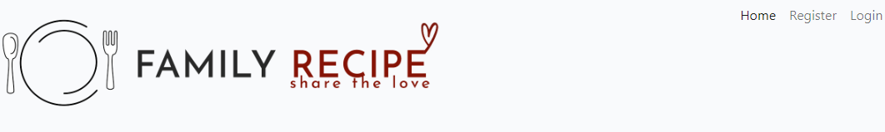
    
    - The navigation bar contains links for the Logo, Home, Register and Login pages.
    - Clicking "Register" directs users to the create account form.
    - Clicking "Login" directs users to the login form.

  - **Logged-in users:**
    
    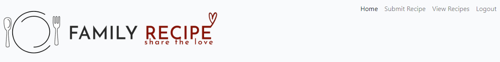

    - The navigation bar contains links for the Logo, Home, Recipes, Add Recipe, and Logout pages.
    - Clicking "Add Recipe" takes the user to a page where they can fill in a form to publish a recipe.
    - Clicking "Logout" directs users to the confirmation page.

- On smaller devices, the navigation bar is displayed using a hamburger menu:

    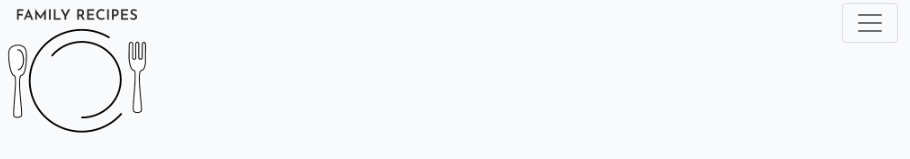

#### Logo

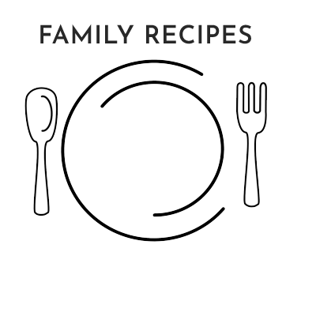<br>
Mobile logo (shown above)
<br>
<br>
Desktop logo (shown above)
<br>
<video controls src="static/images/readme/video-navbar.mov" width="100%"><br>
Video showing responsiveness of menu and change to hamburger menu at media breakpoint.

#### Welcome message


- This section welcomes users to the blog, once the user is logged in this message changes, this was achieved using the django check to see if the user is authenticated.

- The short welcome explains:
  - The concept of the site as a platform to share recipes.
  - That the user will need to create an account to do this.

#### Footer


- The footer

- The footer remains consistent across all pages.

#### Sign Up

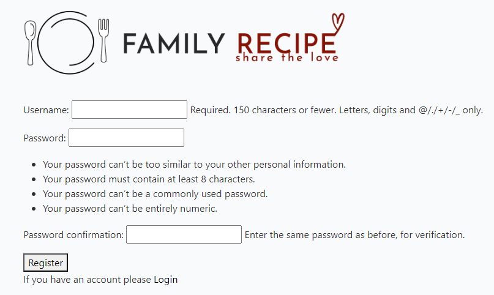

- The form enables users to register and create an account.
- The form includes following fields:
  - Username
  - Email
  - Password
  - Password (again)

#### Login

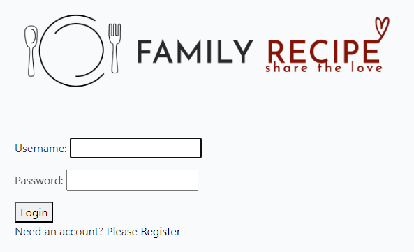

- The form enables users to log in.

- When a user logs in, they gain the ability to:
  - comment on existing recipes,
  - create new recipes.
  - edit/delete their own recipes.

- A message indicating that the operation was successful is shown on the screen.

#### Logout


- When the user clicks on Logout in the navbar, they are redirected to a page displaying a confirmation message above.

  - SIGN OUT:
    - The user redirects to the home page.
    - A message indicating that the operation was successful is shown on the screen.

  - REMAIN LOGGED IN:
    - The user redirects to the home page.


#### Recipes page


- This page shows a list of all the published recipes.

- Information displayed:
  - recipe image;
  - recipe title;
  - create date;
  - category;
  - estimated time of cooking;
  - "View Recipe" button.

- By clicking the "View Recipe" button, the user redirects to a page containing detailed information about that specific recipe.

#### Recipe detail page

The recipe detail page includes the following information:

  - The recipe image (or the default image if the recipe image doesn't load).
  
  - Information field containing some extra information for recipe authors.
    
    - Available for all users:
    
      

      - recipe title;
      - estimated time of cooking;
      - category;
      - number of servings;
      - recipe author;
      - create date;
      - likes icon:
        - logged-in users can like recipes;
        - no-logged users can only see the number of likes.
      - comment icon that shows the number of comments on the selected recipe.
    
    - Extra functionality for the recipe authors:
   
      

      - EDIT
        - By clicking the "EDIT" button, the user is redirected to the page with a form where they can edit the recipe posted by them.
        - The form has the same fields as the "Add a Recipe" form.
        - All the form fields are prepopulated.
      
      - DELETE
        - By clicking the "DELETE" button, the user is redirected to the page where they get a question about whether they are sure that they want to delete the recipe.
       
          
          - The recipe gets deleted when the user clicks the "DELETE RECIPE" button. The user is redirected to the home page.
          - The user is redirected to the home page when clicked the "GO BACK" button.

  - Ingredients section.

  - Instructions section.

  - Comments section:
    
    - There are some comments on the recipe:

      
    
    - There are NO comments:

      

    - Leave a comment (available ONLY for logged-in users):

      

#### Add a Recipe page

- This page includes a form that allows users who are logged in to publish their own recipes.

- Available fields:
  - Title
  
  - Category (Dropdown menu)
  
  - Image
  
  - Ingredients
  
  - Instructions (Summernote field)
  
  - Estimated time
  
  - Servings
  
  
  - Buttons

    
   
    - SAVE:

      - After correctly submitting the form, the user will be redirected to the recipes page upon clicking the save button.

      - A success message is displayed to the user.

    - "CANCEL" button:

       - When the user clicks on the 'go back' button, they will be redirected to the recipes page.


### Future Features

- Make it possible for logged-in users to save recipes as their favorites.

- Add a feature that allows users to click on the author's name and view all the recipes published by that author.

- Add some other choices, like difficulty level, meal type, cuisine.

- Enable users to log in using their social media accounts.

[Back to top ⇧](#table-of-contents)

## Testing and Validation.

Detailed testing of the site can be found at [TESTING.md](TESTING.md). 

Testing includes following:

- Validator testing
- Responsivness & Browser Compability Testing
- Manual Testing
- Automated Testing
- Testing of User Stories
- Lighthouse

## Fixed Bugs

  - Static files were not loading in the deployed Heroku app. The local preview looked just the way it should, but checking the deployed site, none of the styling was there, and the images weren't loading.
    - **Fix**: Install [Whitenoise](https://whitenoise.readthedocs.io/en/latest/index.html) and put some lines of code in settings.py as mentioned in the link.
    - **Update**: The app is working without Whitenoise.

  - Chosen colors (`#71777ce6, whitesmoke and #ffc107`) didn't have sufficient contrast ratio. 
    - **Fix**: Use [Color Contrast Analyzer](https://dequeuniversity.com/rules/axe/4.7/color-contrast) provided by Lighthouse testing to find new colors working good together (see more in the Design section).

  - "Add a Recipe" form.
    
    - When filling out the form, users were presented with a drop-down menu that allowed them to select an author for their recipe. The menu displayed the usernames of every registered user on the website. However, despite the selection made by the user, the recipe was still published under their own name. This bug caused confusion, leading to a poorer user experience.
      - **Fix**: Delete the "author" field from the RecipeForm. The recipe is still published in the user's name without causing any issues or confusion for the user.
    
    - The recipe image failed to display. The default image appeared instead whenever a recipe was published.
      - **Fix**: It turned out that the enctype attribute was missed. I added *enctype="multipart/form-data"* to be able to upload images.

    - The slug wouldn't generate for the recipes submitted via the form.
      - **Fix**: Import slugify and include the helper method into the Recipe model.

        

    - It was possible to choose zero and enter very large numbers into the estimated_time and servings fields.
      
      
      
      - **Fix**: Add validate_nonzero function. Import and add MaxValueValidator.
        
        

    - The layout of the recipe detail page was affected when a user entered a single long word. For example, the one long word typed in the Ingredients field overflowed into the Instructions field and continued beyond the right boundary of the page until the word was finished, causing the page's layout to break. 
      - **Fix**: 
        - Wrap the fields in the container. 
        - Use the word-wrap property with the value of break-word to be able to break the long words and wrap them onto the next line.
    
  - **Forbidden (403). CSRF verification failed. Request aborted.** message was displayed when I was trying to log in to the admin site in the beginning of the project.
    - **Fix**: `Add CSRF_TRUSTED_ORIGINS=['https://*.YOUR_DOMAIN.COM']` to settings.py

## Known issues

Not really a bug, and maybe not even an issue, but like and comment icons don't match each other for logged in users. However, the liking functionality works as it should, so I leave it as is.

- Logged-in users:

  

- Unlogged users: 
  
  

[Back to top ⇧](#table-of-contents)

## Credits

### Media

- All the images used on the website are downloaded from [Unsplash](https://unsplash.com/).

- [Favicon Generator](https://favicon.io/favicon-converter/) was used to generate a favicon from the image.

- [Font Awesome](https://fontawesome.com/) was used to add the icons to the Logo and recipe detail page (estimated time, categories, servings, the number of likes, and the number of comments).

- The recipes published by me are taken from [BBC Good Food](https://www.bbcgoodfood.com/recipes).

### Content

- The main code of this project is based on the Code Institute tutorial ["I Think Therefore I Blog"](https://github.com/Code-Institute-Solutions/Django3blog) with changes made to suit my project. [Django Documentation](https://docs.djangoproject.com/en/4.2/) was used throughout the project.

- I found Stack Overflow to be an excellent source of inspiration and a valuable channel for gaining knowledge. Things I learned and borrow from there:
 
  - Instructions on how to put different background images/background colors on different pages ([click here to read more](https://stackoverflow.com/questions/61434945/putting-a-different-background-image-on-a-different-page-in-a-website))

  - Instructions on how to make navbar links active depending on the page a user is viewing ([click here to read more](https://stackoverflow.com/questions/46617375/how-do-i-show-an-active-link-in-a-django-navigation-bar-dropdown-list))

  - Ability to create/update and delete recipes while getting a success message displayed is achieved by following instructions in two different Stack Overflow articles.
    - [Create/update](https://stackoverflow.com/questions/67366138/django-display-message-after-creating-a-post);
    - [Delete](https://stackoverflow.com/questions/47636968/django-messages-for-a-successfully-delete-add-or-edit-item).

  - A method to generate slug for recipes submitted through the site form ([click here to read more](https://stackoverflow.com/questions/837828/how-do-i-create-a-slug-in-django)).

  - PositiveIntegerFields (estimated_time and servings) were validated by following instructions in this [article](https://stackoverflow.com/questions/2248617/0-value-in-django-positiveintegerfield).

- The option to sort recipes by category was implemented following [Very Academy](https://www.youtube.com/watch?v=S9-Bt1JgRjQ&t=2137s) tutorial. I made some modifications in order to show my categories in the form of clickable "boxes" instead of displaying them in the navbar.

- The CSS code for category boxes to zoom/scale in on hover was borrowed from [W3Schools](https://www.w3schools.com/howto/howto_css_zoom_hover.asp).

- [Secret Key Generator](https://miniwebtool.com/django-secret-key-generator/) was used to generate Django Secret Key.

### Acknowledgements

I would like to aknowledge the following people:

  - Sean from the Tutor Assistance team for teaching me about the CSS word-wrap Property (used on the recipe detail page), helping me with my models testing and with updating timeout function for alert messages due to utilizing the newer version of Bootstrap. 

  - My mentor Jubril for good briefings, feedback and tip. 

  - Daisy_mentor (#project-portfolio-4) for sharing information about closing completed User Stories.

  - Kay (the facilitator in my team) for always patiently answering all my questions during our Monday sessions &#128512;

  - Karolis_5P and Emma S-A_5P (Peer Code Review) who took time to look at my project, check the functionality and come up with valuable feedback.

  - Tutor Assistance Team for helping me out with diverse things throughout the project.

[Back to top ⇧](#table-of-contents)

## Deployment

### Installing Django and supporting libraries

- Install **Gunicorn**(the server that is used to run Django on Heroku): `pip3 install django gunicorn`

- Install **dj_database_url** and **pyscopg2**(connect to PostegreSQL): `pip 3 install dj_database_url pyscopg2`

- Install **Cloudinary** (The cloud platform used to store static media files): `pip3 install dj3-cloudinary-storage`

- Install **Whitenoise** (The library that allows the web app to serve its static files.): `pip3 install whitenoise`


### Create App

- Create Project.

- Create App.

- Add App to installed apps in **settings.py**:

  ````
  INSTALLED_APPS = [
    ...
    'APP_NAME',
  ]
  ````

### Create a new external database

- Navigate to **ElephantSQL.com** and click **“Get a managed database today”**.

- Click **Create New Instance**.

- Set up your plan:
  - give your plan a Name;
  - select the Tiny Turtle (Free) plan.

- Click **“Select Region”** and select a data center near you.

- Click **"Review"**, check that your details are correct and click **“Create instance”**.

- Return to the dashboard and click on the database instance name for this project.

- Copy the database URL.


### Create the Heroku app

 - Sign up for Heroku and accept terms of service.

 - Click the **"Create a new app"** button.

 - Give your app a name and select the region closest to you. A name must be unique.
  

### Create an env.py file

- Create **env.py** file and check that the file is included in the **.gitignore file**.

- Import os library: `import os`.

- Set environment variables:
  - **DATABASE_URL** with the value you just copied from ElephantSQL: `os.environ["DATABASE_URL"]="<copiedURL>`
  - **SECRET_KEY**: `os.environ["SECRET_KEY"] = "randomSecretKey"` ([Secret Key Generator](https://miniwebtool.com/django-secret-key-generator/) was used to generate a secret key).


### Update settings.py

- Add the following code:

  ````
  import os
  import dj_database_url
  if os.path.isfile('env.py'):
      import env
  ````

- Remove the insecure secret key provided by Django. Change your SECRET_KEY variable to the following: `SECRET_KEY = os.environ.get('SECRET_KEY')`

- Comment out the original **DATABASES** variable and add the code below:

  ````
  DATABASES = {
      'default': dj_database_url.parse(os.environ.get("DATABASE_URL"))
  }
  ````

- Save all files and make migrations: `python3 manage.py migrate`


### Connecting Heroku to the database

- Go back to the Heroku dashboard and open the **Settings** tab:

- Create _Config Vars_:
  - KEY: **PORT** | VALUE: **8000**.
  - KEY: **SECRET_KEY** | VALUE: **randomSecretKey**(the value that is in env.py)
  - KEY: **DATABASE_URL** | VALUE: **ElephantSQL database url**(no quotation marks needed)
  - KEY: **DISABLE_COLLECTSTATIC** | VALUE: **1** (Temporary to be able to deploy the project as we do not have any static files yet)


### Get static and media files stored on Cloudinary

- Create a Cloudinary account (steps can be found in the [Code Institutes](https://learn.codeinstitute.net/courses/course-v1:CodeInstitute+FST101+2021_T1/courseware/b31493372e764469823578613d11036b/9236975633b64a12a61a00e0cca7c47d/?child=first) tutorial in LMS).

- Copy **API Environment Variable** in the Cloudinary dashboard.

- Go back to **env.py** and add a new environment vriable:
  - **CLOUDINARY_URL** with the value just copied from the dashboard ⇧(remove CLOUDINARY_URL in the beginning).

- HEROKU: Add a new _Config Var_ with the KEY **CLOUDINARY_URL**, and the same value(URL) as in the step above.

- **settings.py**:

  - Add Cloudinary Libraries to installed apps (the order is important):

    ````
    INSTALLED_APPS = [
      ...,
      'cloudinary_storage',
      'django.contrib.staticfiles',
      'cloudinary',
      ...,
    ]
    ````
  
  - Tell Django to use Cloudinary to store media and static files:
   
    ````
    STATICFILES_STORAGE = 'cloudinary_storage.storage.StaticHashedCloudinaryStorage'
    STATICFILES_DIRS = [os.path.join(BASE_DIR, 'static'), ]
    STATIC_ROOT = os.path.join(BASE_DIR, 'staticfiles')

    MEDIA_URL = '/media/'
    DEFAULT_FILE_STORAGE = 'cloudinary_storage.storage.MediaCloudinaryStorage'
    ````
 
### Tell Django where templates will be stored

  - Link file to the templates directory in Heroku. _Place under the BASE_DIR line_:

    `TEMPLATES_DIR = os.path.join(BASE_DIR, 'templates')`

  - Change the templates directory to TEMPLATES_DIR:

    ````
    TEMPLATES = [
    {
      ...,
      'DIRS': [TEMPLATES_DIR],
      ...,
          ],
        },
      },
    ]
    ````

### Add Heroku Hostname to ALLOWED_HOSTS

  ````
  ALLOWED_HOSTS = ['app-name.herokuapp.com', 'localhost']
  ````

### Create a Procfile

`web: gunicorn whatscooking.wsgi`


### Go back to Heroku

- Click on the **"Deploy"** section on the top of the page.

- Select **GitHub** as deployment method and click the **"Connect to GitHub"** button.

- Search for the repository for this project, _what-is-cooking_. 

- Click **"Connect"** to link up Heroku app to the GitHub repository.

- Click on **"Deploy Branch"**.

- Click the **"Enable Automatic Deploys"** button to make it possible for Heroku to rebuild the app a new change is pushed to GitHub repository.

[Back to top ⇧](#table-of-contents)

## Development 

## Fork

- Log in to **GitHub** and ind the repository for this project, [_Kattis91/what-is-cooking_](https://github.com/Kattis91/what-is-cooking).

- In the top-right corner of the page, click **Fork**.

- Type some new name into the "Repository name" field to distinguish your fork from the upstream repository.

- Click **Create Fork**.

- The fork is now in your personal account and can be changed in the way you want.

## Clone

- On **GitHub**, navigate to your fork of the _what-is-cooking_ repository.

- Above the list of files, click **<>Code**.

- Copy the **URL** for the repository. Repository can be cloned in three different ways:
  - **HTTPS**;
  - **SSH**;
  - **GitHub CLI**.

- Open Terminal and change the current working directory to the location where you want the cloned directory.

- Type `git clone`, and paste the URL you copied earlier. Press **Enter**