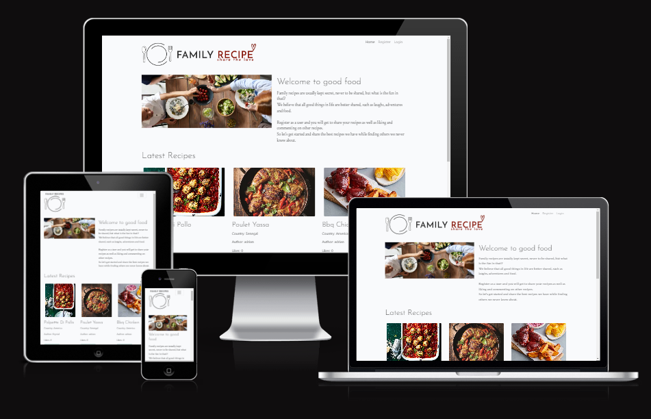
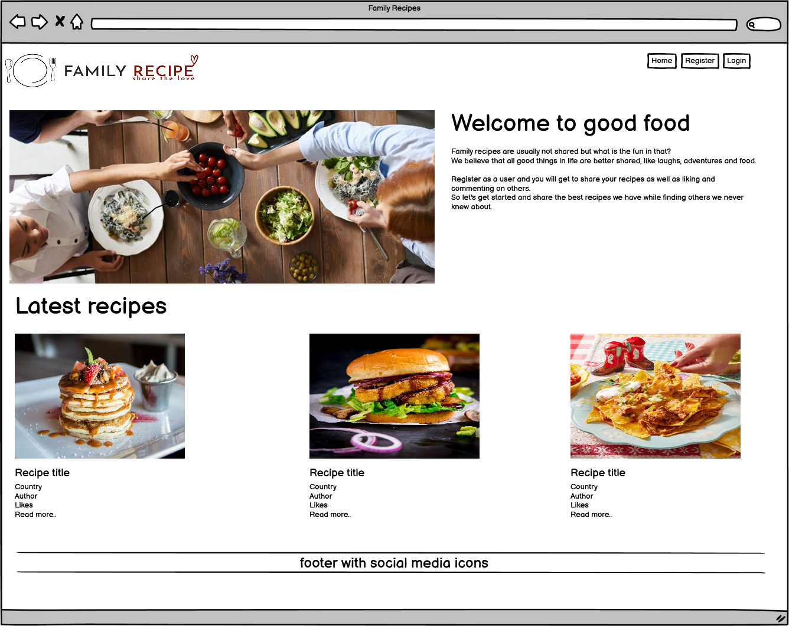
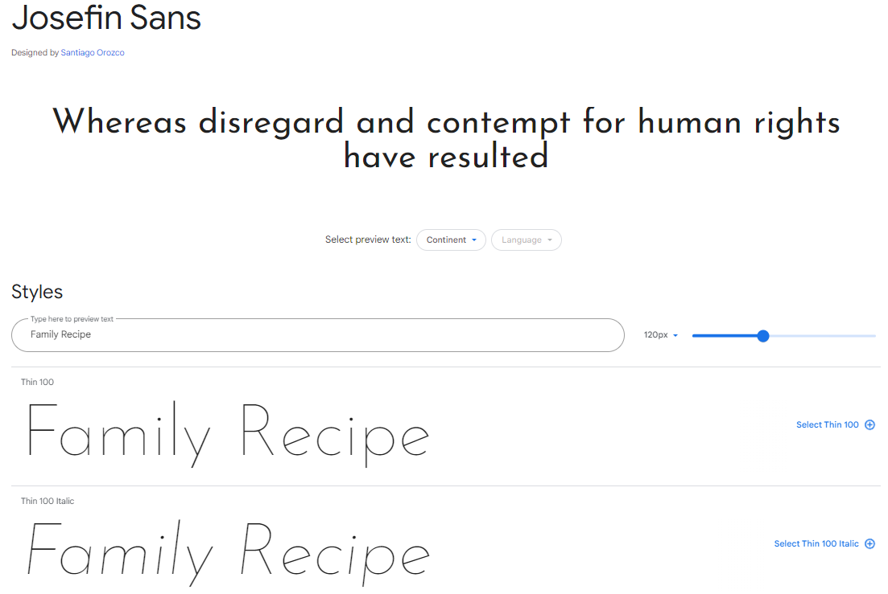
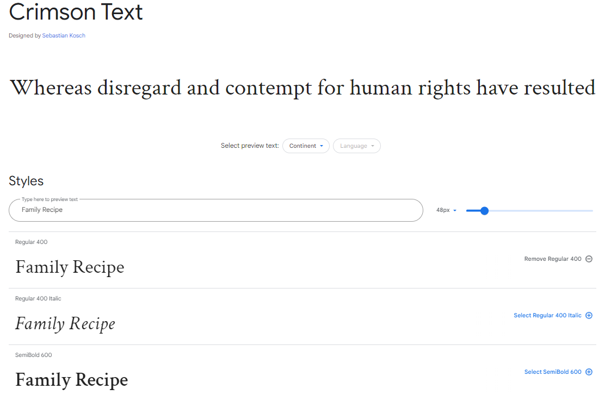
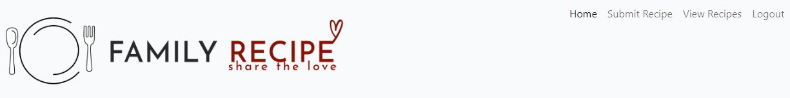

# Family Recipes
 
- [Live Site](https://comingsoon.herokuapp.com/)
- [GitHub Repo](https://github.com/adrianskelton/adrianproject4)

Family Recipe is a recipe sharing website where users can upload and share recipes as well as reading others, I thought about this as I have a family recipe book from South Africa and I think it would be great to have a website where family members could share their family recipes with eachother and the world. 
I also wanted a rating system based on the ammount of like and a comment section for recipes. 
 

## Table of contents

## Overview
lorumipsum

## UX
Five Planes Of Website Design: 
### 1. Strategy

To create a website with good UI and UX 

- Project Setup
  - Create 

- UX
  - Favicon logo

- Navigation
  - lorumipsum

- CRUD
  - lorumipsum
- Authentication
  - lorumipsum
- Validation
  - lorumipsum
- Administration
  - lorumipsum
- Deployment
  - lorumipsum
- Testing
  - lorumipsum
- Documentation
  - lorumipsum

 

**Agile Methodology**  
I used Agile methodology. 
I used [GitHub](https://github.com/) for all the user stories and epics. As the user stories were accomplished, they were moved in the GitHub Kanban board from **ToDo**, to **In Progress**, **Done** and **Not Implemented** lists.
The board can be viewed [here](https://github.com/users/adrianskelton/projects/5/).

**Kanban Board**  
  

Sprint 1: Base Setup

|EPIC|User Story|Description|
|:--|:--|:--|
|Project Setup|Project setup|As a developer, I need to set up the project so that it is ready for implementing the core features.|

 

Sprint 2: Navigation & Account Creation

|EPIC|User Story|Description|
|:--|:--|:--|
|**Project Setup**|||
|Navigation|Navbar|As a developer I need to create a navbar so that users can navigate the site.|

 

Sprint 3: Styling

|EPIC|User Story|Description|
|:--|:--|:--|
|CRUD|Create a recipe|As a logged in user I create a recipe.|

 

Sprint 4: CRUD

|EPIC|User Story|Description|
|:--|:--|:--|
|CRUD|Delete recipe|As a logged in user I can delete a recipe.|

 

Sprint 5: Search & Email

|EPIC|User Story|Description|
|:--|:--|:--|
|Administration|Admin search|As an admin I can filter and search the recipes so that I can find more relevant recipes easily.|

 

Sprint 6: Testing & Documentation

|EPIC|User Story|Description|
|:--|:--|:--|
|Testing|Unit Tests|As a developer I need to use testing so that I an sure my code is free of bugs and will not result in site errors.|

 

### 2. Scope

**Simple and Intuitive UX** 
- Create a website that makes people want to share and read recipes.

**Relevant Content** 
- Make all the content easily accessible

**Responsiveness** 
- Create a responsive website that works on every device and screen size.  

### 3. Structure

The website is designed with the user in mind and has the pages listed below:
- Landing page
  - Recipes
  - Login
- Account Home

There are also 2 pages available to users who are signed in:
- Submit Recipes
- Login

#### Navigation

The navbar is bootstrap .
All users will see:
- lorum ipsum

A user who isn't signed in will see:
- lorum ipsum

 

A user who is signed in will see:
- My Account
- Logout

 

Hamburger menu image. 
 

Hover effect of links. 
 

#### Footer

The footer is the same across all the pages and includes:
- Social Media Icons (Facebook, Instagram, Github)
- A copyright statement

Link hover effect to show the link is active. 
 

#### Pages

##### Landing Page

The landing page is divided into 4 sections:
- Hero Image  Logo
- Recipe section

##### Sign Up Page

 

This page uses the allauth template as a base with custom design added.
The username and password fields are mandatory but the email is optional. If the user signs up with and includes and email address they will be sent email updates on:
- lorum ipsum

##### Sign In Page

 

This page 

##### Account Home Page

 

This page shows the users recipes.
On a large screen it is divided into 2 sections:
- lorum ipsum

lorum

##### Admin Account Home Page
 
The account home page for an Admin user has the addition of a Search recipes panel giving the admin user the ability to search by:
- Date of recipe
- Username

If the number of recipes exceeds 25 the page paginates. 

##### Submit Recipte

The Submit recipe has 6 inputs:
- A name of the recipe
- The country of origin
- Description
- Cooking instructions
- Ingredients list

The form has built in validation to alert the user if:
- There are fields missing

Once a recipe has been successfully added the user is taken back to the user account page and a message saying "recipe saved" will dissapear after 5 seconds. 

 

User's View 
 
Admin's View 
 

##### Update Recipe

If the user clicks on the edit recipe button recipe detail page they are then taken to the recipe selected to edit and save again.
Once a recipe has been successfully edited the user is taken back to the user account page and a message saying "recipe saved" will dissapear after 5 seconds. 

##### Confirm Delete Recipe Page
 
If the user clicks on the 'Delete Recipe' they will be asked if they are sure they want to delete it.

#### Sitemap
The project flowcharts for the site structure was created using [LucidChart](https://www.lucidchart.com/).

Sitemap:

 

### 4. Skeleton

**Wireframes**

The completed site may differ slightly as this was only the inception of the sites ideas. The wireframes for mobile and desktop were created with [Balsamiq](https://balsamiq.com/) tool and can be viewed 

Here:

Homepage (guest) 
 
Homepage (user) 
 
Login 
 
Register 
 

 

**Database**
The project uses ElephantSQL as PostgreSQL relational database for storing the data. I used lucidcharts to display the relationships to the different database tables. The main relationships were based on the likes model as these were called both in the recipe model to show the total likes and related back to the unique users, and then also the users liked recipes.

  
Model

   

 

### 5. Surface

#### Color Scheme and Fonts

- The fonts used for this site were imported from [Google Fonts](https://fonts.google.com/):
  - Josefin for the headings
  
  - Crimson for the body
  

- The colors used were based on the the colors in the logo and the hero image tomato color that stood out to me. I chose the primary color to invoke a feeling of warmth of sharing recipes with community and it matched the heart color as part of the logo. 
  - #7E180D color1
  - #FFFFFF color2 
  - #313131 color3

#### Visual Effects

**Hover effects** 
NavBar desktop 
 
Navbar smaller screens 
- The navbar is at the top right of every page. 
- If the user is logged in or is a guest the menu content changes appropriately. 
- The hamburger menu is applied on media breakpoint of 979px. This was when the text from the navbar started going into the family recipe logo and looked cluttered.
- I kept the menu clean with no additional styling to focus attention on the recipes and content instead.

 

**Footer** 

The footer is 

**Logo** 

 
Mobile logo
 
 
Desktop logo
 
<video controls src="static/images/readme/video-navbar.mov" width="100%"> 
Video showing responsiveness of menu

## Features

### Existing Features

#### Recipe Modal
The 

##### Recipe List
Each recipe is displayed on a card on the account home page and contains:
lorumipsum

##### Update Recipe Page
lorumipsum

##### Confirm Delete Recipe Page
lorumipsum

##### Admin Search Panel
lorumipsum

##### Update Email
lorumipsum

##### Change Password
Users can change their password from the account panel in the account home page. 

### Potential Future Features
- Allow admin users to edit the services from the account home rather than from the django backend panel

## Responsive Layout and Design
The bootstrap grid system and flexbox was used to create a fully responsive layout and testing on multiple screen sizes and devices was carried out to make sure it each page looks good in many settings.

**Tested devices:**

- iPhone 13
- Google pixel 4
- Huawei matebook 14 

## Tools Used

- [GitHub](https://github.com/) for hosting 
- [Color palette generator](https://coolors.co/7e180d-ffffff-313131) for generating color palette

### Python packages

- [Django](https://www.djangoproject.com/) used as the framework 

A full list of the requirements and the versions used can be found in the requirements.txt file. To install them and run them on your own machine first setup a virtual environment with the command to create a venv...  
`python3 -m venv venv`  
Then this command to run it...  
`source venv/bin/activate`  
To stop running the environment simply type the command...  
`deactivate`

To create the requirements.txt file I ran the following command: 
`pip3 freeze > requirements.txt`

## Testing

Tests  [TESTING.md](TESTING.md).

## Bugs

- lorumipsum

## Deployment

### ElephantSQL

### Cloudinary

### Heroku

    
### Fork the repository

### Clone the repository

- lorumipsum

## Credits

To style the forms I watched the following tutorials
- [Style Django Forms With Bootstrap - Django Blog #5](https://www.youtube.com/watch?v=6-XXvUENY_8&ab_channel=Codemy.com)
- [Tip for changing logo based on screen size](https://stackoverflow.com/questions/34984737/display-a-different-logo-on-mobile-and-desktop)

### Content
asdfasdf

### Media
logo [Casdfaa](https://asdfasdafgb/).

### Code

- Django's :
  - [asdfe](asdfasdfa)
  - [sf](asdasdf.html)

## Acknowledgements

- lorumipsum