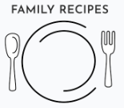

#### Pages

##### Landing Page

The landing page is divided into 4 sections:
- Hero Image  Logo
- Recipe section

lorum

##### Admin Account Home Page
 
The account home page for an Admin user has the addition of a Search recipes panel giving the admin user the ability to search by:
- Date of recipe
- Username

If the number of recipes exceeds 25 the page paginates. 

##### Submit Recipte

The Submit recipe has 6 inputs:
- A name of the recipe
- The country of origin
- Description
- Cooking instructions
- Ingredients list

The form has built in validation to alert the user if:
- There are fields missing

Once a recipe has been successfully added the user is taken back to the user account page and a message saying "recipe saved" will dissapear after 5 seconds. 

 

User's View 
 
Admin's View 
 

##### Update Recipe

If the user clicks on the edit recipe button recipe detail page they are then taken to the recipe selected to edit and save again.
Once a recipe has been successfully edited the user is taken back to the user account page and a message saying "recipe saved" will dissapear after 5 seconds. 

##### Confirm Delete Recipe Page
 
If the user clicks on the 'Delete Recipe' they will be asked if they are sure they want to delete it.

#### Sitemap
The project flowcharts for the site structure was created using [LucidChart](https://www.lucidchart.com/).

Sitemap:

 

### 4. Skeleton

**Wireframes**

The completed site may differ slightly as this was only the inception of the sites ideas. The wireframes for mobile and desktop were created with [Balsamiq](https://balsamiq.com/) tool and can be viewed 

Here:

Homepage (guest) 
 
Homepage (user) 
 
Login 
 
Register 
 

 

**Database**
The project uses ElephantSQL as PostgreSQL relational database for storing the data. I used lucidcharts to display the relationships to the different database tables. The main relationships were based on the likes model as these were called both in the recipe model to show the total likes and related back to the unique users, and then also the users liked recipes.

  
Model

   

 

### 5. Surface

#### Visual Effects

**Hover effects** 
NavBar desktop 
 
Navbar smaller screens 
- The navbar is at the top right of every page. 
- If the user is logged in or is a guest the menu content changes appropriately. 
- The hamburger menu is applied on media breakpoint of 979px. This was when the text from the navbar started going into the family recipe logo and looked cluttered.
- I kept the menu clean with no additional styling to focus attention on the recipes and content instead.

 

**Footer** 

The footer is 

**Logo** 

 
Mobile logo
 
 
Desktop logo
 
<video controls src="static/images/readme/video-navbar.mov" width="100%"> 
Video showing responsiveness of menu

## Features

### Existing Features

#### Recipe Modal
The 

##### Recipe List
Each recipe is displayed on a card on the account home page and contains:
lorumipsum

##### Update Recipe Page
lorumipsum

##### Confirm Delete Recipe Page
lorumipsum

##### Admin Search Panel
lorumipsum

##### Update Email
lorumipsum

##### Change Password
Users can change their password from the account panel in the account home page. 

### Potential Future Features
- Allow admin users to edit the services from the account home rather than from the django backend panel

## Responsive Layout and Design
The bootstrap grid system and flexbox was used to create a fully responsive layout and testing on multiple screen sizes and devices was carried out to make sure it each page looks good in many settings.

**Tested devices:**

- iPhone 13
- Google pixel 4
- Huawei matebook 14 

## Tools Used

- [GitHub](https://github.com/) for hosting 
- [Color palette generator](https://coolors.co/7e180d-ffffff-313131) for generating color palette
- [Cloudconvert](https://cloudconvert.com/webm-to-mov) for converting the video from webm to mov

### Python packages

- [Django](https://www.djangoproject.com/) used as the framework 

A full list of the requirements and the versions used can be found in the requirements.txt file. To install them and run them on your own machine first setup a virtual environment with the command to create a venv...  
`python3 -m venv venv`  
Then this command to run it...  
`source venv/bin/activate`  
To stop running the environment simply type the command...  
`deactivate`

To create the requirements.txt file I ran the following command: 
`pip3 freeze > requirements.txt`

## Testing

Tests  [TESTING.md](TESTING.md).

## Bugs

- lorumipsum

## Deployment

### ElephantSQL

### Cloudinary

### Heroku

    
### Fork the repository

### Clone the repository

- lorumipsum

## Credits

### Content
asdfasdf

### Media
logo [Casdfaa](https://asdfasdafgb/).

### Code

- Django's :
  - [asdfe](asdfasdfa)
  - [sf](asdasdf.html)

## Acknowledgements

- lorumipsum