# Testing

Go back to [README.md](README.md)

## Code Validation

### HTML

Results from [HTML W3C Validator](https://validator.w3.org)

| Page         | Screenshot                           | Notes                       |
|--------------|--------------------------------------|-----------------------------|
| Home         | 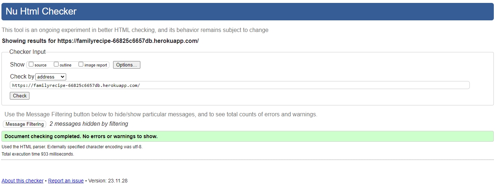 | Pass: No Errors, No warning |
| Submit Recipe        | 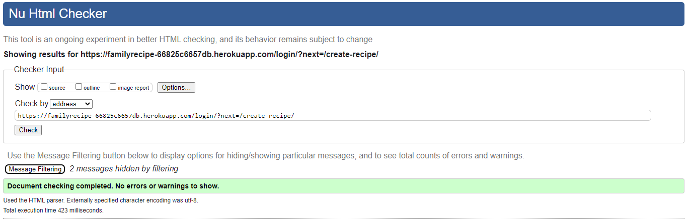 | Pass: No Errors, No warning |
| All Recipes | 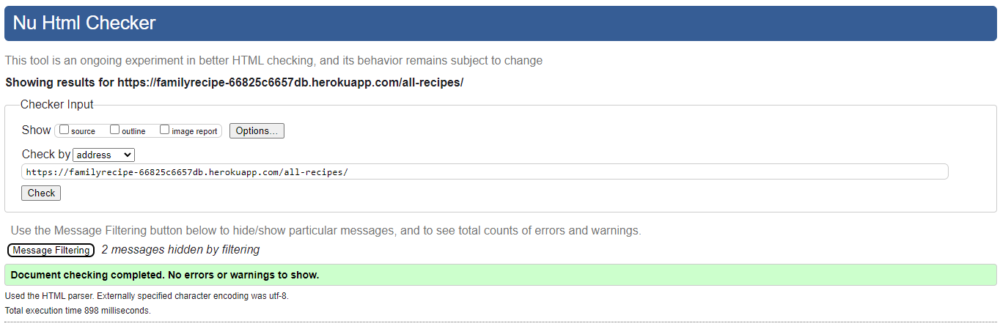 | Pass: No Errors, No warning |
| Recipe Detail       | 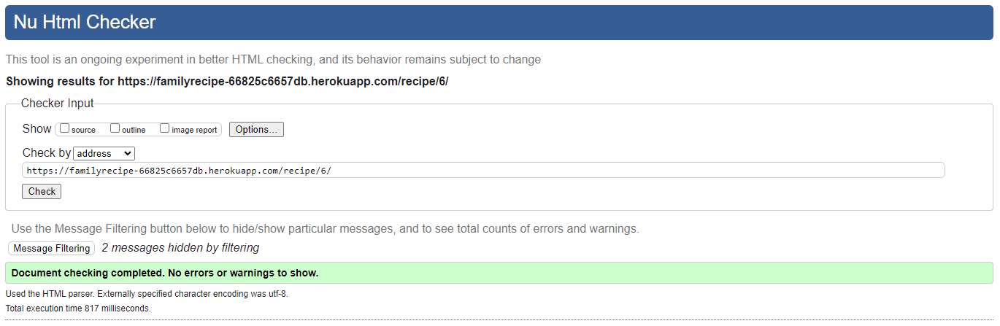 | Pass: No Errors, No warning |
| Logout         | 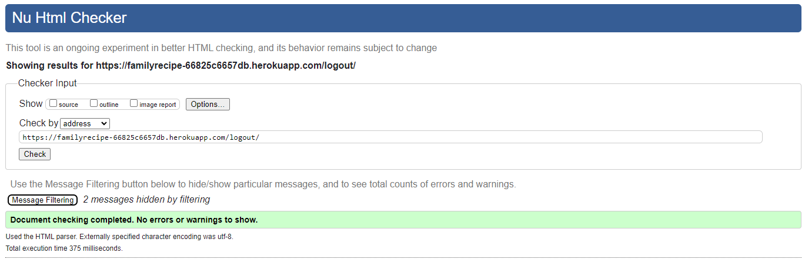 | Pass: No Errors, No warning |
| User Recipe          | 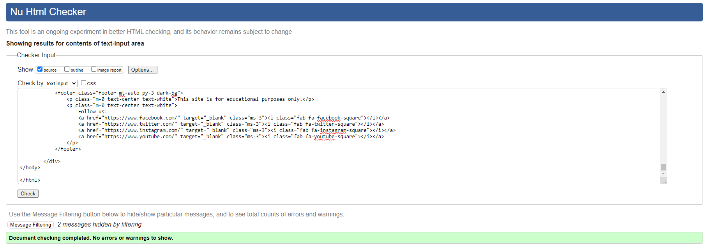 | Pass: No Errors, No warning |

### CSS

Results from [CSS Jigsaw Validator](https://jigsaw.w3.org/css-validator) for CSS file validation

| File       | Screenshot                                        | Notes           |
|------------|---------------------------------------------------|-----------------|
| styles.css |  | Pass: No Errors, No warning  |

### Python

Results from [PEP8 CI Python Linter](https://pep8ci.herokuapp.com) for python validation

| File      | CI URL                                  | Screenshot                           | Notes                       |
|-----------|-----------------------------------------|--------------------------------------|-----------------------------|
| views.py  | [PEP8 CI](https://pep8ci.herokuapp.com) | 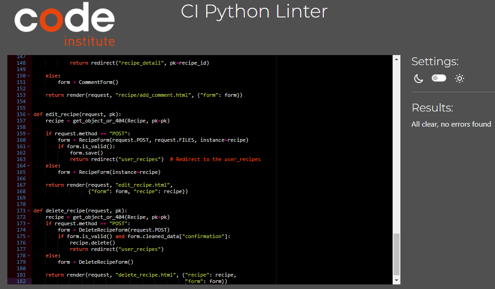 | Pass: No Errors, No warning |
| models.py | [PEP8 CI](https://pep8ci.herokuapp.com) | 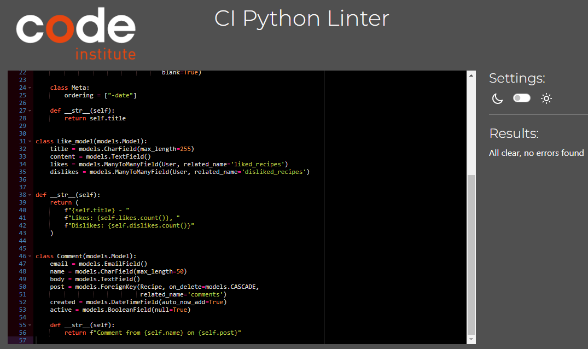 | Pass: No Errors, No warning |
| urls.py   | [PEP8 CI](https://pep8ci.herokuapp.com) | 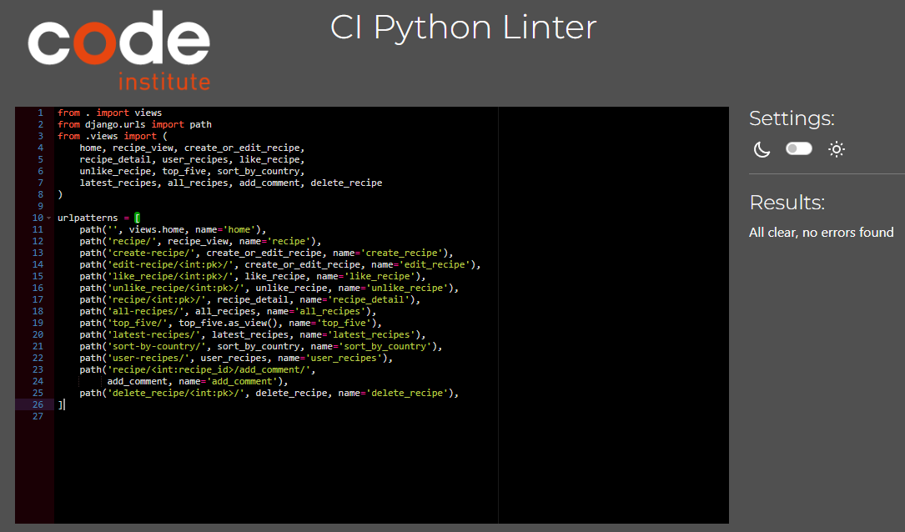 | Pass: No Errors, No warning | 
| forms.py  | [PEP8 CI](https://pep8ci.herokuapp.com) |  | Pass: No Errors, No warning |

## Browser Compatibility

Compatibility with various browsers have also been tested manually and site passed all criterias.

## Manual test for responsive

Aggressive manual test has been performed to check responsiveness of site


## Lighthouse Results

Lighthouse chrome extension has been used to test the site

| Page       | Size    | Screenshot                            | 
|------------|---------|---------------------------------------|
| Home       | Mobile  | 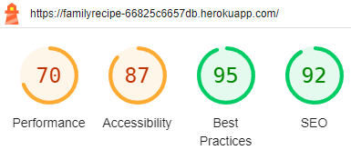  | 
| Home       | Desktop | 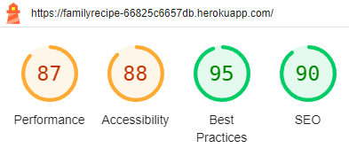 | 
| Register    | Mobile  | 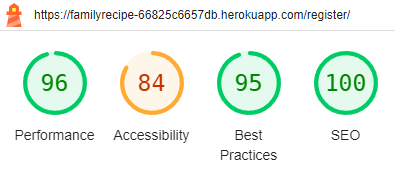  | 
| Register    | Desktop | 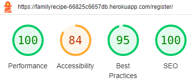 | 
| Login      | Mobile  | 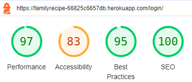  | 
| Login      | Desktop | 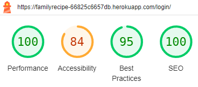 | 
| Recipe Detail     | Mobile  | 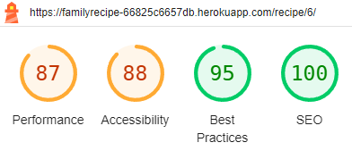  | 
| Recipe Detail     | Desktop | 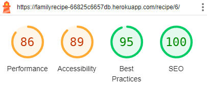 | 
| User Recipes     | Mobile  | 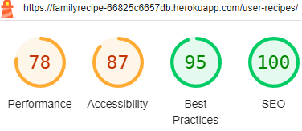  | 
| User Recipes     | Desktop |  | 


## Testing of User Stories

- **I used Milestones to keep track on my EPICS**

- One User story remains incomplete: "Top Five". This User story will not be done this time. This particular feature is not crucial or vital and can be postponed until the next opportunity. However, I had started this that is why it is still in templates and in some of the code.

**To make it easier to follow, I tested User Stories in groups. First, those that belong to different Epics, then "must-haves", "should-haves" and last "could-haves."**

### EPIC: Authentication:

| User Story | How are they achieved? |
|------------|------------------------|
| As a Site User I can register an account so that I can access publishing, commenting, and liking features. | The user can easily register by creating a username and password. The email field is optional. Upon successful registration, the user is automatically logged in. |
| As a Site User I can sign in with my username and password so that I can share my recipes and like/comment on others' | The user can log in using their registered username and password. The "Add Recipe" link appears in the navbar along with options to like/comment on recipes. |
| As a logged-in user I can easily log out so that I can avoid somebody else accessing my account. | The user can easily log out. User needs to confirm that they want to log out before it is done. |


### EPIC: CRUD functionality:

| User Story | How are they achieved? |
|------------|------------------------|
| As a logged-in User I can create/publish recipes with family and the world. | When logged in, the user can easily publish a recipe by clicking the "Add Recipe" link in the navbar and filling out the form. |
| As a Site user I can read published recipes from other users. | The "Recipes" page is easily accessible from the navbar and provides detailed information for each recipe (the user just needs to click the "View Recipe" button at the top menu).|
| As a logged-in User I can see what I have published so that I can correct and add information as well as delete the recipe. |All of the users recipes will be shown via the view your recipe link that is shown on the home page once the user logs in. Front this page they are then able to edit or delete their recipes too|


### EPIC: Administration:

| User Story | How are they achieved? |
|------------|------------------------|
| As a Site Admin I can create, read, update and delete posts so that I can manage my recipe content. | The admin of the site can publish recipes, and update/delete all the recipes regardless of who published them. |
| As a Site Admin I can view, approve, and delete comments so that I can remove any inappropriate content. | The admin of the site can easily view, approve, and delete comments. Comments are only published after admin approval. These features are accessible when logged in at "/admin". |
| As a Site Admin I can see the likes of recipes | The admin of the site can see the likes of the recipes and which user liked them "/admin". |


[Back to top ⇧](#table-of-contents)

## Python (unnitest)

### Setting Up Unnitest


#### 1. Create Database credentials in settings.py

Create database for testing you can also use docker to create one using following command

```bash
DATABASES = {"default": {"ENGINE": "django.db.backends.sqlite3", "NAME": "mydatabase"}}

if "DATABASE_URL" in os.environ:
    logger.info("Adding $DATABASE_URL to default DATABASE Django setting.")
    DATABASES["default"] = dj_database_url.config(conn_max_age=600)
    DATABASES["default"]["init_command"] = "SET sql_mode='STRICT_TRANS_TABLES'"
   ```

#### 3. Provide credentials

run the test file

````bash
python3 manage.py test
````

#### 4. Running Tests

To run your tests, use the following command in your terminal:

python manage.py test


## Results

The result of my test case was as follows, unfortunately I tried to diagnose the problem but was unable to find why the user was not created.

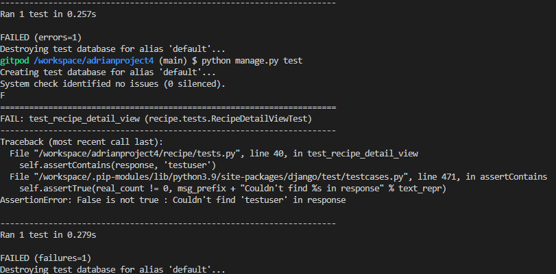

## Bugs

None 

## Unfixed Bugs

- No other known bugs

## Credits

- I got help from various youtube videos about debugging [Start Python Debugging With pdb](https://www.youtube.com/watch?v=bHx8A8tbj2c&ab_channel=RealPython)
- I ran through the django testing documentation [Dango testing](https://docs.djangoproject.com/en/5.0/topics/testing/overview/)
- Information about database setup was obtained from [Stackoverflow](static/images/testing/test-error2.png)